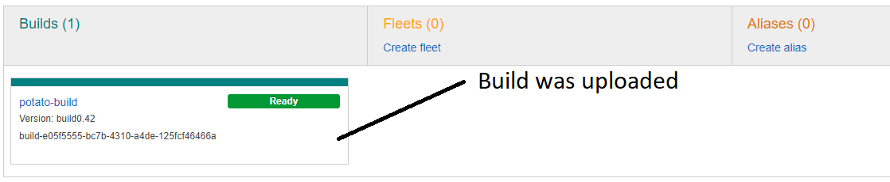
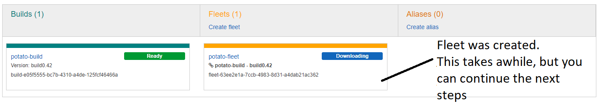
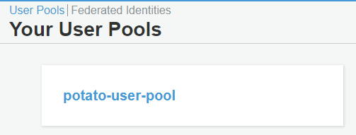
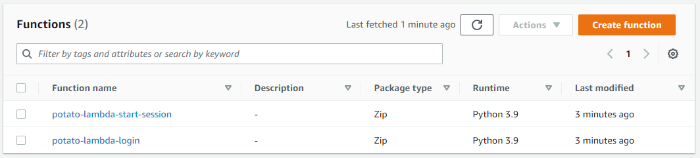
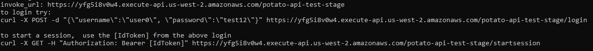

## AWS Backend Setup
1. Using the IAM Management Console, to create a profile to give to the aws_backend.py script.  
   ```
   {
    "Version": "2012-10-17",
    "Statement": [
        {
            "Sid": "VisualEditor0",
            "Effect": "Allow",
            "Action": [
                "gamelift:*",
                "apigateway:*",
                "cognito-idp:*",
                "iam:GetRole",
                "iam:PassRole",
                "iam:PutRolePolicy",
                "iam:CreateRole",
                "lambda:*"
            ],
            "Resource": "*"
        }
     ]
   }
   ```
3. I use a user called sean_gl, set permissions in IAM Management console and used aws configure import --csv file://new_user_credentials.csv to add the credentials for it on my PC.

2. **Tweak command line aws_setup.py to match your project**
   1. Run aws_setup.py with no parameters.  This will display the default settings.  Tweak the following:
      | Setting | Purpose | Example
      | --- | --- | --- |
      |prefix| represents a namespace for all of the other params| potato
      |build_root| where to find the UE server build you want to push| E:\unreal_projects\ue5_gamelift_plugin_test\MyProject\ServerBuild\WindowsServer
      |fleet_launch_path|the server exe to run| C:/game/MyProject/Binaries/Win64/MyProjectServer.exe
      |profile|the iam profile to use| dave
      |region|the aws region to use| us-west-2
      
      By specifying them on the command line.  e.g.
      
      ```aws_setup.py --prefix=potato --build_root=E:\unreal_projects\ue5_gamelift_plugin_test\MyProject\ServerBuild\WindowsServer -- fleet_launch_path=C:/game/MyProject/Binaries/Win64/MyProjectServer.exe --profile=dave --region=us-west-2```

3. **Upload your build to GameLift**
   1. Using the aws_setup command line you configured above add the command 'create build'.  e.g.
   2. ```aws_setup.py --prefix=potato --build_root=E:\unreal_projects\ue5_gamelift_plugin_test\MyProject\ServerBuild\WindowsServer -- fleet_launch_path=C:/game/MyProject/Binaries/Win64/MyProjectServer.exe --profile=dave --region=us-west-2``` **create build**
   3. Use the gamelift dashboard to verify your build has been uploaded
      

4. **Start your fleet**
   1. Using the aws_setup command line from above but this time use **create fleet**
   2. Use the gamelift dashboard to verify your fleet was created:
      
   3. If you see the error "botocore.errorfactory.LimitExceededException: An error occurred (LimitExceededException) when calling the CreateFleet operation: Current limit of fleets of 1 have been reached.", try specifying a different ec2 instance type. e.g.
      ```--fleet_ec2_instance_type=c5a.large```

5. **Initialize the User Pool**
   1. Using the aws_setup command line from above but this time use **create user_pool**
   2. Use the Amazon Cognito dashboard to verify your user pool was created:
     
     
6. **Install Lambdas**
   1. Using the aws_setup command line from above but this time use **create user_pool**
   2. Use the Lambda dashboard to verify they were created
      
   
7. **Install Rest API**
   1. Using the aws_setup command line from above but this time use **create rest_api**
   2. The output will provide you with the invoke_url and instructions on how to test it using curl:
      
   3. Make note of this invoke_url
   4. At this point the backend is all ready to go.
