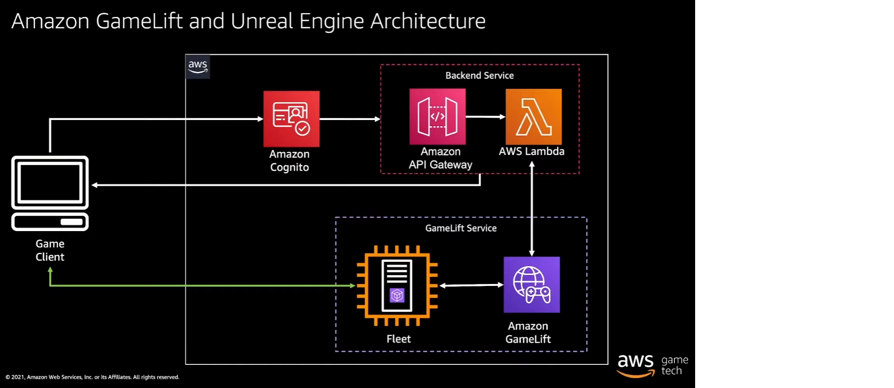

# Series Notes

This project is based on the Amazon's series [Building Games on AWS: Amazon GameLift & UE4](https://www.youtube.com/playlist?list=PLuGWzrvNze7LEn4db8h3Jl325-asqqgP2).  In this series Dylan, Chanh and Zack go step-by-step to build up this system from scratch.  

## Episode Notes
* Episode 1: Discuss the architecture of the system.[^aws_gamelift_episode_1]
* Episode 2: Build the UE Game Client maps and UE server target.[^ue_setup_dedicated_server][^aws_gamelift_episode_2]
* Episode 3: Integrate the GameLiftServer SDK into the server build.[^aws_gamelift_episode_3]
* Episode 4: Upload the server and start a fleet.[^aws_gamelift_episode_4]
* Episode 5: Build out the start session lambda to allocate servers from the fleet setup above. [^aws_gamelift_episode_5]
* Episode 6: Setup authentication with Cognito, setup a login lambda, and use API Gateway to connect a REST API to this and the start session lambda. [^aws_gamelift_episode_6]
* Episode 7: Add an OfflineGameMode and an OfflineMainMenu widget so the UE5 client can send and receive HTTP5 login and start session requests. [^aws_gamelift_episode_7]
* Episode 8: Wrap up.  Warnings about shutting down your fleets to avoid charges and future directions.[^aws_gamelift_episode_9]

## Series Architecture diagram
Here is the diagam from Episode 1:

* It's AWS service-centric.  
* It does not use all of the AWS or GameLift features.  e.g. FlexMatch and FleetIQ are not included.  A more fully featured and complicated architecture could look like [this](https://docs.aws.amazon.com/gamelift/latest/developerguide/gamelift_quickstart_customservers_designbackend_arch_serverless.html).  

## Series Bookmarks
Unreal Bookmarks:
* Setting maps and modes.  Episode 2 at 14:34 [Maps and Modes](https://youtu.be/cUcTJjqSCos?t=874)
* Choosing maps to package. Episode 2 at 15:20 [Package Maps](https://youtu.be/cUcTJjqSCos?t=920)
* Create a shortcut to the server with -log. Episode 2 at 17:40 [Shortcut](https://youtu.be/cUcTJjqSCos?t=1060)
* Create an Main Menu Widget for the Offline Map.  Episode 7 at 31:17 [Offline Main Menu Widget Bookmark](https://youtu.be/lhABExDSpHE?t=1877)
* Create an install script to upload. Episode 4 at 9:52 [Install script](https://youtu.be/Q6kOpObWsUI?t=587)

AWS Bookmarks:
* Cognito auth flows. Episode 6 at 1:18 [Auth Flows](https://youtu.be/EfIuC5-wdeo?t=137)
* Cognito App client. Episode 6 at 2:55 [Cognito App Client](https://youtu.be/EfIuC5-wdeo?t=172)

## Footnotes
[^ue_setup_dedicated_server]: [Unreal Engine 5.0 Documentation: Setting Up Dedicated Servers](https://docs.unrealengine.com/5.0/en-US/setting-up-dedicated-servers-in-unreal-engine/)
[^aws_gamelift_episode_1]: [Amazon GameLift-UE4 Episode 1: Intro and Architecture Review](https://youtu.be/3_iBuko39JA)
[^aws_gamelift_episode_2]: [Amazon GameLift-UE4 Episode 2: UE4 Dedicated Server](https://youtu.be/cUcTJjqSCos)
[^aws_gamelift_episode_3]: [Amazon GameLift-UE4 Episode 3: Integrate GameLiftServer SDK with UE4](https://youtu.be/Sl_i6YIgQqg)
[^aws_gamelift_episode_4]: [Amazon GameLift-UE4 Episode 4: Testing and Uploading Server Build to GameLift](https://youtu.be/Q6kOpObWsUI)
[^aws_gamelift_episode_5]: [Amazon GameLift-UE4 Episode 5: StartGameLiftSession](https://youtu.be/\_EynplPECNk)
[^aws_gamelift_episode_6]: [Amazon GameLift-UE4 Episode 6: Amazon Cognito and API Gateway](https://youtu.be/EfIuC5-wdeo)
[^aws_gamelift_episode_7]: [Amazon GameLift-UE4 Episode 7: API Requests from the Game Client](https://youtu.be/lhABExDSpHE)
[^aws_gamelift_episode_8]: [Amazon GameLift-UE4 Episode 8: Next Steps](https://youtu.be/lwYFZFYvSgE)
